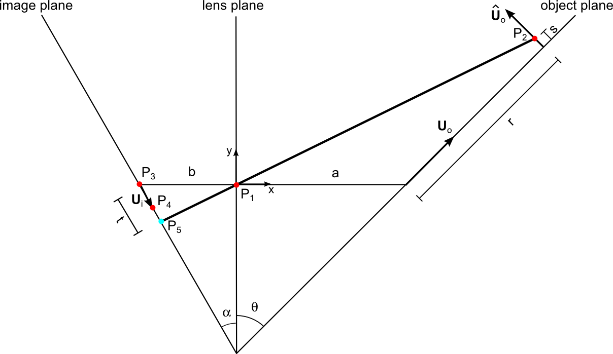

==============
Camera
==============

The camera and the camera calibration is handled by a the camera
object. There are several camera models implemented. Some details for
each camera model is given below.

---------------------
Default Camera object
---------------------

This is the base class for other camerase simples camera is the base
class camera. This does not do much - it simply uses the same
coordinate system for object and image. This is convinient for some
tests and for other cases where only the image itself is of interest.

------------------
One2One model
------------------

This class is basically the same as the ``Camera`` class, but two
extra methods (``x2X`` and ``dx2dX``) are added to support
transformation from image coordinates to object coordinates.

------------------
Linear 2D model
------------------

PIV done with a single camera with a high quality lens, it is fair to
assume a simple linear relation between object space and the image
plane. We will call this 2D PIV since it is both two-dimensional (in a
plane) and two-component (in-plane velocity components). The mapping
between object and image is handles by a matrix that takes care of
translation, stretching and rotation:

.. math::
   \left[ 
   \begin{array}{c} 
       x_0 \\ x_1 
   \end{array} 
   \right] = 
   \left[
   \begin{array}{ccc}
       a_{11} & a_{12} & a_{13} \\ a_{21} & a_{22} & a_{23}
   \end{array} 
   \right]
   \left[
   \begin{array}{c}
      X_0 \\ X_1 \\ 1
   \end{array}
   \right]

Note that in this model we ignore the out-of-plane component
:math:`X_2` in the object space.

-------------------
Linear 3D model
-------------------

The linear model can be extented to three-dimensions. This model is
often referred to as the Direct Linear Transform (DLT).  Now all three
components of a point is included. An intermediate vector
:math:`\mathbf{k}` is calculated. The last value of this vector is
used to account for perspective effects.  

.. math::
   \left[ 
   \begin{array}{c} 
       k_0 \\ k_1 \\ k_2 
   \end{array} 
   \right] = 
   \left[
   \begin{array}{cccc}
       a_{11} & a_{12} & a_{13} & a_{14} \\ 
       a_{21} & a_{22} & a_{23} & a_{24} \\
       a_{31} & a_{32} & a_{33} & a_{34}
   \end{array} 
   \right]
   \left[
   \begin{array}{c}
      X_0 \\ X_1 \\ X_2 \\ 1
   \end{array}
   \right]

The perspective effect is done as

.. math::
   x_0 = \frac{k_0}{k_2}, \;\;\; x_1 = \frac{k_1}{k_2}

--------------------
Pinhole camera model
--------------------

The pinhole camera model is an extention of the Linear3D model that
takes common defects of an optical lens into account. The model works
in several steps:

1. A transformation like the Linear3D, but to intermediate coordinate
   system using object space scaling, with origin at intersection
   between image plane and optical axis and with axes aligned with
   camera chip.
2. A correction of optical destortion depending on radius from optical 
   axis and on tangential effects.
3. A simple mapping from the intermediate coordinates to the image 
   coordinates.

The first part is done with a translation vector :math:`t_i` and a
rotation matrix :math:`r_{ij}`. 

------------------------------
Scheimpflug model
------------------------------

The Scheimpflug configuration uses a tilted backplane of the camera to
create focus all over the image when the object plane is tilted with
respect to the lens plane. This is the case for stereoscopic PIV. The
condition is basically that the object plane, the lens plane and the
image plane should intersect at the same line in space. This is
illustrated on the figure below:

The pinhole is located at the point :math:`P_1` which is also the
origin of the coordinate system :math:`(x,y)`. We want to find the
image coordinates of a point :math:`P_2` in the object plane with
coordinates :math:`\mathbf{X}=(X_0, X_1, X_2)`. To ease the notation,
we let :math:`r=X_0` and :math:`s=X_2`. In the image plane we define
three points: :math:`P_3` is the intersection with the optical axis
(line through pinhole perpendicular to lens plane), :math:`P_4` is a
horizontal unit vector (length one pixel) away from
:math:`P_3`. Finally :math:`P_5` is the point that we want to
find. The parameter :math:`t` is the distance between the :math:`P_3`
and :math:`P_5` in pixels.

Only four parameters are needed to establish the calibration:

* Camera magnification :math:`M`
* Angle :math:`\theta` betweeen object plane and camera lens
* Pixel pitch in the two image coordinate directions :math:`(p_0,p_1)`
* Focal length :math:`f`

The two first parameters our given specifically, the two last
parameters are standard parameters saved in the camera object. From
these parameters we can find the distances along the optical axis
:math:`a` and :math:`b` between lens and object plane and between lens
and image plane, respectively. We use the "lens makers formula" and
definition of :math:`M`:

.. math::

   \frac{1}{f} = \frac{1}{a} + \frac{1}{b} \;\; \land \;\;  M = \frac{b}{a} 
   \;\;\; \Rightarrow  \;\;\;  a = \frac{(M+1)f}{M}

It then follows that :math:`b = Ma`.  We also find the angle
:math:`\alpha` that the image plane (camera chip) has been tilted with
respect to the lens plane:

.. math::
   
   \frac{\tan \alpha}{\tan \theta} = \frac{b}{a} 
   \;\;\; \Rightarrow \;\;\; 
   \alpha = \tan^{-1}(M \tan \theta)

We define unit vectors in :math:`X_0` direction: :math:`\mathbf{U}_o =
(U_{ox}, U_{oy}) = (\sin \theta, \cos \theta)`, in :math:`X_2`
direction: :math:`\hat{\mathbf{U}}_o = (-U_{oy}, U_{ox})` and in first
image coordinate: :math:`\mathbf{U}_i = p_0(\sin \alpha, -\cos \alpha) =
(U_{ix}, U_{iy})`. 

The five points in the figure above have the following coordinates:

.. math::

   P_1 &= (0,0) \\
   P_2 &= (a,0) + r \mathbf{U}_0 + s \hat{\mathbf{U}}_0
          = (a + r U_{ox} - s U_{oy}, r U_{oy} + s U_{ox}) \\
   P_3 &= (-b , 0) \\
   P_4 &= (-b , 0) + \mathbf{U}_i = (-b+U_{ix}, U_{iy}) \\
   P_5 &= P_3 + t \mathbf{U}_i = (-b + t U_{ix}, t U_{iy})

We want to find the intersection point :math:`P_5` described by the
the parameter :math:`t` that corresponds to :math:`x_0`. We use a formula given by `Poul Bourke`_: 

.. _Poul Bourke: http://local.wasp.uwa.edu.au/~pbourke/geometry/lineline2d/

.. math::

   t &= \frac{(x_2-x_1)(y_1-y_3) - (y_2-y_1)(x_1-x_3)}
             {(y_4-y_3)(x_2-x_1) - (x_4-x_3)(y_2-y_1)} \\
     &= \frac{(a+rU_{ox}-sU_{oy}-0)(0-0) - (rU_{oy}+sU_{ox}-0)(0+b)}
             {(U_{iy}-0)(a+rU_{ox}-sU_{oy}-0) -
                (-b+U_{ix}+b)(rU_{oy}+sU_{ox}-0)} \\
     &= \frac{-b(rU_{oy} + sU_{ox})}
             {U_{iy}(a+rU_{ox}-sU_{oy}) - U_{ix}(rU_{oy}+sU_{ox})}

The find the other other image coordinate :math:`x_1`, we use a local
magnification :math:`M_L`:

.. math::

   M_L = \frac{|P_5 - P_1|}{|P_2-P_1|}
       = \sqrt{\frac{(-b + tU_{ix})^2 + (tU_{iy})^2}
                    {(a+rU_{ox}-sU_{oy})^2 + (rU_{oy}+sU_{ox})^2}}

Finally, since the image coordinte system have origin at the upper
left pixel, we need to add the image coordinates of the center of the
image censor, :math:`(x_{0,center}, x_{1,center})`:

.. math::

   x_0 &= t +  x_{0,center} \\
   x_1 &= M_L X_1/p_1 + x_{1,center}
 
To make the inverse function ``x2X``, we use the same principles to
get the following expression:

.. math::

   r = \frac{t U_{iy} a}{-U_{oy} b + t U_{oy} U_{ix} - t U_{ox}
   U_{iy}}

   
Note that we have set :math:`s=0`, i.e. we project the image
coordinates to the plane with :math:`X_2 = 0`.
